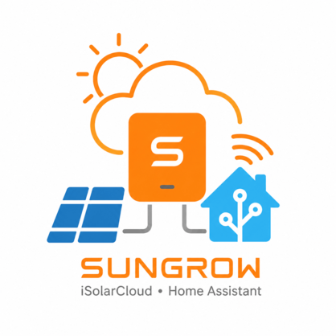

# HA-Sungrow — Sungrow iSolarCloud integration for Home Assistant

  

> [!WARNING]
> **Work in progress.** This project is still being built and tested and is
> **not ready for general use**. Expect breaking changes, renamed entities
> and rough edges. Use at your own risk for now.

A custom Home Assistant integration that reads data from a Sungrow solar
system through the official
[iSolarCloud OpenAPI](https://developer-api.isolarcloud.com/) (V1 account
login, no OAuth). It creates sensors for plant-level and hybrid-inverter /
battery data such as PV power, load power, battery state of charge and
charging/discharging power.

## Features

- Config flow (UI) setup — no YAML required
- Automatic discovery of the devices in your plant (`ps_id`)
- Plant-level sensors (PV power, load power, daily/total yield, feed-in and
  purchased energy, battery SoC, ESS charge/discharge energy, …)
- Hybrid inverter / energy-storage sensors (battery charging/discharging
  power, battery level, battery health, battery temperature, purchased
  power/energy, generation, …)
- Battery/BMS sensors (voltage, current, temperature, SOC, SOH, total
  charge/discharge)
- Sensor names and units come from the iSolarCloud point metadata
  (`getOpenPointInfo`) with built-in fallbacks; SOC/SOH ratio points are
  automatically converted from fractions to percentages
- Automatic token renewal and re-authentication flow
- Configurable polling interval (default 5 minutes — the cloud only refreshes
  about that often)

## Prerequisites

1. An [iSolarCloud](https://www.isolarcloud.com/) account that can see your
   plant.
2. A developer application on the
   [Sungrow developer portal](https://developer-api.isolarcloud.com/):
   - Log in to the portal, open **Applications** and click **Create**.
   - Request access *without* OAuth 2.0 (V1). Approval usually takes a couple
     of days.
   - Once approved, open the application details to find your **App key** and
     **Secret key** (used as the `x-access-key` header).
3. Your **plant ID (`ps_id`)**. You can find it in the developer portal
   documentation by using *Try it* on the *Plant List* call, or in the
   iSolarCloud web UI URL when viewing your plant.

## Installation

### HACS (recommended)

1. In HACS, add this repository
   (`https://github.com/steven-g-w/HA-Sungrow`) as a **custom repository** of
   type *Integration*.
2. Install **Sungrow iSolarCloud** and restart Home Assistant.

### Manual

1. Copy `custom_components/sungrow_isolarcloud` into the
   `custom_components` folder of your Home Assistant configuration directory.
2. Restart Home Assistant.

## Configuration

1. Go to **Settings → Devices & services → Add integration** and search for
   **Sungrow iSolarCloud**.
2. Fill in:
   - **API gateway** — pick your region's gateway from the dropdown
     (`https://augateway.isolarcloud.com` for Australia; other regional
     gateways are listed and a custom URL can be typed).
   - **App key** and **Secret key** from your developer application.
   - **iSolarCloud username** and **password**.
   - **Plant ID (`ps_id`)**.
3. Submit — the integration validates the credentials by logging in and
   listing the plant's devices, then creates the sensors.

The polling interval can be changed later via the integration's
**Configure** button.

## Sensors

Sensors are created for every measuring point that returns a value, grouped
into devices:

- **Plant** (`<ps_id>_11_0_0`): plant power, load power, daily/total yield,
  daily/total feed-in energy, daily/total purchased energy, battery SoC,
  ESS daily/total charge and discharge energy, …
- **Hybrid inverter / energy storage** (device type 14): total DC power,
  daily/total generation, battery charging/discharging power, battery level
  (SoC), battery SOH, battery temperature, purchased power and energy,
  feed-in power and energy, load consumption, …
- **Battery / BMS** (device type 43, e.g. SBR-series): voltage, current,
  temperature, SOC, health, total charge/discharge energy

Points that your plant/app does not expose are simply skipped, and new points
appearing later are added automatically.

Energy sensors use `total_increasing` state class, so they can be used
directly in the Home Assistant **Energy dashboard**.

## Device control (optional, off by default)

The integration can also *control* the hybrid inverter through the OpenAPI's
parameter-setting endpoints. This is **disabled by default** — enable it via
the integration's **Configure** dialog ("Enable device control"). When
enabled (and the device passes the API's support check), these entities are
added to the inverter device:

- **Select**: charging/discharging command (Charge / Discharge / Stop)
- **Number**: charging/discharging power, SOC upper/lower limit, forced
  charging target SOC 1/2, max charging/discharging power
- **Switch**: forced charging enable
- **Time**: forced charging window 1/2 start and end times

Writes are sent as iSolarCloud parameter tasks to the physical device and
typically take a few seconds to complete. Use with care — these change how
your inverter and battery operate.

## Roadmap

- [x] Control support (charge/discharge scheduling)
- [ ] More device types (string inverters, meters, chargers)
- [ ] Statistics/history backfill from the cloud

## Credits

Reference material used while building this integration:

- [jsanchezdelvillar/Sungrow-API](https://github.com/jsanchezdelvillar/Sungrow-API)
- [MickMake/GoSungrow](https://github.com/MickMake/GoSungrow)
- [bugjam/pysolarcloud](https://github.com/bugjam/pysolarcloud)

## Disclaimer

This project is not affiliated with Sungrow. Use at your own risk.
