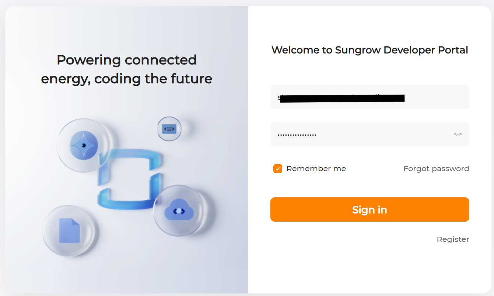
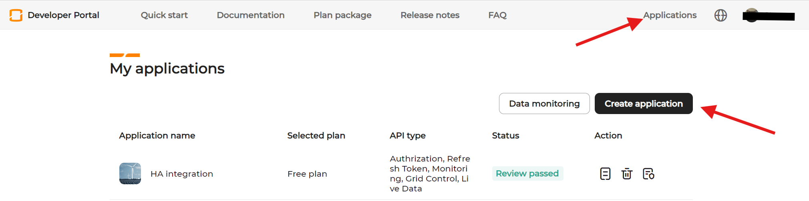
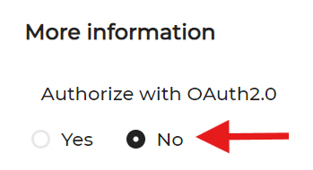
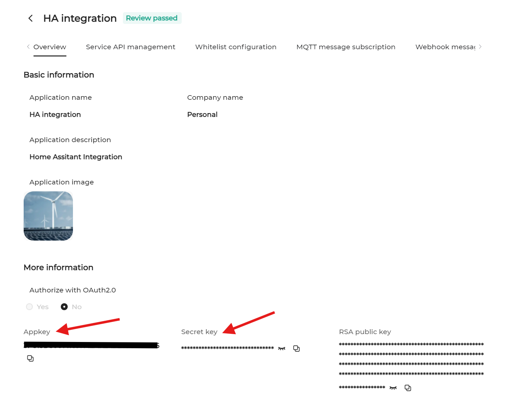
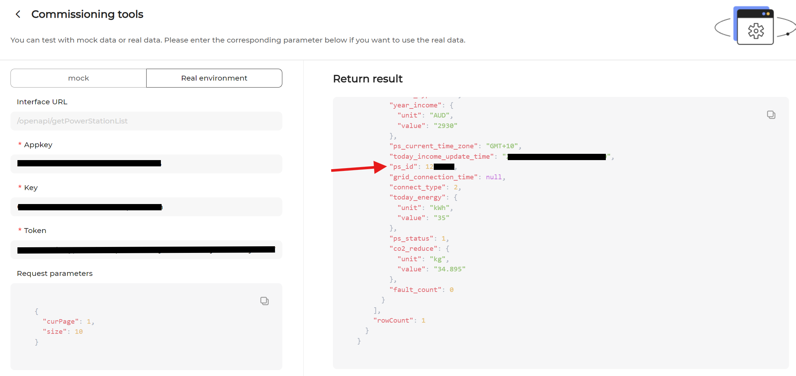
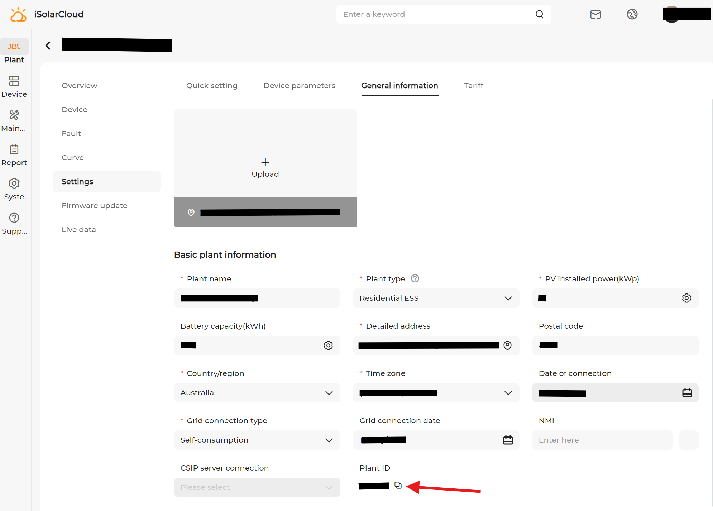

# Getting your iSolarCloud credentials

This guide walks through obtaining every value the integration's setup
dialog asks for:

| Setup field | Config key | Where it comes from |
|---|---|---|
| API gateway | `base_url` | Your account's region (see [Step 3](#step-3-pick-your-api-gateway)) |
| App key | `app_key` | Sungrow developer portal ([Step 2](#step-2-create-a-developer-application)) |
| Secret key (x-access-key) | `secret_key` | Sungrow developer portal ([Step 2](#step-2-create-a-developer-application)) |
| iSolarCloud username | `username` | Your iSolarCloud account ([Step 1](#step-1-isolarcloud-account)) |
| iSolarCloud password | `password` | Your iSolarCloud account ([Step 1](#step-1-isolarcloud-account)) |
| Plant ID (optional) | `ps_id` | Auto-detected, or [Step 4](#step-4-optional-find-your-plant-id-ps_id) |

You need two separate things: a **regular iSolarCloud account** (the one
you already use in the app to watch your solar system) and a **developer
application** on the Sungrow developer portal (which gives you the app key
and secret key). Both are free.

> [!NOTE]
> Screenshots below have account names, keys, tokens and plant IDs blacked
> out — the real values are unique to your account and will look different.

---

## Step 1: iSolarCloud account

If you already use the **iSolarCloud** mobile app to monitor your system,
you're done with this step — the integration uses the same username
(usually your email address) and password.

If not, register an account first:

1. Install the **iSolarCloud** app (App Store / Google Play) or go to
   [www.isolarcloud.com](https://www.isolarcloud.com/) and register.
2. Make sure the account can actually **see your plant** — open the app
   and check that your solar system shows up on the home screen. If it
   doesn't, ask your installer to share the plant with your account.

> [!NOTE]
> The account must be able to see the plant. An account with no plants
> will fail setup with "No plants were found" (unless you enter a
> `ps_id` manually, which then also fails if the account has no access
> to it).

## Step 2: Create a developer application

The app key and secret key come from the
[Sungrow developer portal](https://developer-api.isolarcloud.com/).

1. Go to [developer-api.isolarcloud.com](https://developer-api.isolarcloud.com/)
   and log in — you can use your iSolarCloud account, or register a
   developer account if prompted.

2. Open the **Applications** section and click **Create application**.

3. Fill in the application form. The important part:
   - Choose access **without OAuth 2.0** — this integration uses the
     **V1 account login**, not OAuth.
   - Name and description can be anything (e.g. "Home Assistant").

4. Submit and wait for approval. Sungrow reviews applications manually;
   approval **usually takes a couple of days**. You'll see the status on
   the applications page (and may get an email).

5. Once approved, open your application's details page (**Overview**
   tab). Copy:
   - **Appkey** → the integration's **App key** field
   - **Secret key** → the integration's **Secret key (x-access-key)**
     field

> [!TIP]
> Keep both keys private — together with your username and password they
> allow full API access to your plant, including device control if your
> application has that permission.

## Step 3: Pick your API gateway

iSolarCloud runs separate regional servers, and your account only exists
on one of them. Pick the gateway matching the region your account was
registered in (the setup dialog offers these in a dropdown; a custom URL
can also be typed):

| Region | Gateway |
|---|---|
| Australia | `https://augateway.isolarcloud.com` |
| Europe | `https://gateway.isolarcloud.eu` |
| China | `https://gateway.isolarcloud.com` |
| International (rest of world) | `https://gateway.isolarcloud.com.hk` |

Not sure which region you're in? The developer portal documentation page
shows the gateway list, and the server your iSolarCloud app connects to
is chosen when the account is created. If setup fails with
"cannot connect" or "authentication failed" and you're certain the
credentials are right, try the next plausible gateway.

## Step 4 (optional): Find your plant ID (`ps_id`)

**You can normally skip this.** Leave the field empty and the integration
discovers the plant from your account automatically. Only fill it in if
your account can see **several plants** and you don't want the first one.

Two ways to find it:

### Option A: developer portal "Try it"

1. In the developer portal, open the **Documentation** and find the
   **Plant List** (`getPowerStationList`) endpoint's commissioning/testing
   tool.
2. Switch to **Real environment**, fill in your Appkey, secret key and
   token, and run it. The response lists your plants; the `ps_id` field of
   each entry is the plant ID.

### Option B: iSolarCloud web UI

1. Log in at [www.isolarcloud.com](https://www.isolarcloud.com/) (use
   the regional site matching your account).
2. Open your plant, go to **Settings → General Information**, and copy the
   **Plant ID** field near the bottom of the page.

